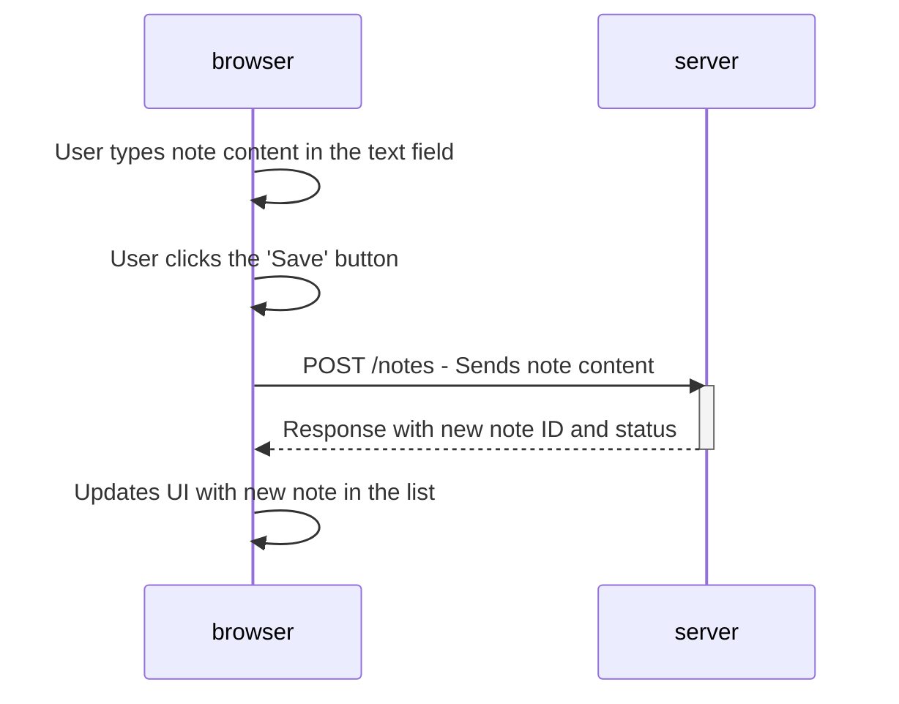

```mermaid
sequenceDiagram
    participant browser
    participant server

    browser->>browser: User types note content in the text field
    browser->>browser: User clicks the 'Save' button

    browser->>server: POST /notes - Sends note content
    activate server
    server-->>browser: Response with new note ID and status
    deactivate server

    browser->>browser: Updates UI with new note in the list
```
